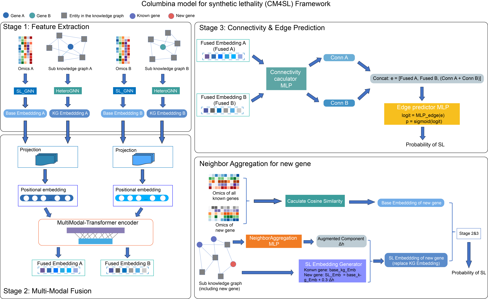

# Columbina Model for Synthetic Lethality (CM4SL)

CM4SL 是一个基于图神经网络和多模态 Transformer 的合成致死（Synthetic Lethality, SL）预测模型，支持直推式（Transductive）和归纳式（Inductive）学习，可评估模型在未知基因对或未知基因上的泛化能力。

## 项目简介

合成致死是指两个基因同时失活导致细胞死亡，而单独失活任一基因则不影响生存。CM4SL 利用多组学数据（表达、CNV、突变、甲基化、基因依赖性）和知识图谱（基因-疾病、基因-通路、PPI 等）预测基因对是否为合成致死。

系统支持三种评估场景：

- **C1（直推式）**：按基因对划分，训练集与测试集无重叠基因对，但基因可以重叠。
- **C2（归纳式）**：按基因划分，测试集中每条边恰好有一个基因出现在训练集中（半新基因）。
- **C3（归纳式）**：按基因划分，测试集中的两个基因均未出现在训练集中（全新基因）。

## 系统架构

数据层 → 基因ID映射（ENTREZID） → 多组学特征标准化/PCA
↓
图构建层 → SL图（基因对边） + 知识图谱（异质图）
↓
模型层 → SL-GNN + 知识图谱GNN + 多模态Transformer融合 → 边预测
↓
训练层 → 早停、学习率调度、交叉验证、注意力可视化

# 环境要求

- Python 3.12+
- CUDA 12.4+
- 核心依赖：
  torch>=2.6.0
  torch-geometric>=2.7.0
  pandas>=2.3.3
  numpy>=2.0.1
  scikit-learn>=1.7.0
  matplotlib>=3.10.7
  seaborn>=0.13.2
  transformers>=4.30.0

# 运行方式

完整参数说明

   --scenario       场景选择：C1, C2, C3
   --device         运行设备：cuda, cpu, gpu, auto（默认：auto）
   --mode           学习模式：inductive, transductive（自动根据场景选择）
   --epochs         训练轮次（覆盖配置文件）
   --test           测试模式（简化运行）
   --seed           随机种子（默认：42）
   --log-level      日志级别：DEBUG, INFO, WARNING, ERROR, CRITICAL（默认：INFO）
   --cv             启用交叉验证
   --folds          交叉验证折数（默认：10）
   --samples-per-class 每类样本数（默认：20000）
   --save-all       保存所有中间结果

```python
   基础用法
        # 运行C1场景
        python main.py --scenario C1 --device cuda

        # 运行C2场景
        python main.py --scenario C2 --device cuda

        # 运行C3场景
        python main.py --scenario C3 --device cuda

    高级选项
        # 指定其他设备（GPU/CPU，默认cuda）
        python main.py --scenario C2 --device cpu

        # 启用交叉验证（10折）
        python main.py --scenario C2 --cv --folds 10

        # 测试模式（快速运行）
        python main.py --scenario C1 --test --epochs 50

        # 自定义参数
        python main.py --scenario C3 --epochs 300 --seed 123 --log-level DEBUG

        # 保存所有中间结果
        python main.py --scenario C1 --save-all
```
# 输出文件

运行后，结果保存在 output/{scenario}/ 目录下：

文件	内容
best_model.pth / best_inductive_model.pth	最佳模型权重
training_history.csv	训练损失、验证 AUC 等历史
test_metrics.csv	测试集指标（AUC, AUPRC, F1, 准确率等）
predictions.csv	所有样本的预测概率
final_training_progress.png	训练曲线图
inductive_evaluation_curves.png	归纳模型评估曲线（ROC, PR, 阈值分析）
gene_id_to_symbol.csv	基因 ID 与符号映射
preprocessing_info.json	标准化器与 PCA 参数

交叉验证模式下还会生成 *_cv/ 文件夹，包含各折详细报告和汇总统计。

# 注意事项

1. ID 锚定模式：系统默认使用 ENTREZID 作为基因唯一标识，需提供从基因Symbol到基因ENTREZID的映射文件，此文件应至少包含 ENTREZID 和 SYMBOL 列。本项目默认使用input_data/ 目录下的human_gene_mapping.csv文件基因 ID 映射表

2. 硬件要求：直推式（C1）需要较大显存（建议 24GB），归纳式（C2/C3）需要约 8GB。本项目使用一张 NVIDIA GeForce RTX 4090 显卡进行训练。

3. 随机种子：设置 RANDOM_SEED 可保证实验可重复性。


# Columbina Model for Synthetic Lethality (CM4SL)

CM4SL is a graph neural network based model for predicting synthetic lethality (SL) using multi-omics data and a knowledge graph. It supports both transductive and inductive learning to evaluate generalization to unseen gene pairs or entirely new genes.

## Overview

Synthetic lethality occurs when the simultaneous inactivation of two genes causes cell death, while the inactivation of either gene alone is viable. CM4SL integrates multi-omics profiles (expression, CNV, mutation, methylation, dependency) and a biomedical knowledge graph (gene–disease, gene–pathway, PPI, etc.) to predict whether a gene pair is synthetic lethal.

Three evaluation scenarios are implemented:

- **C1 (Transductive)**: Split by gene pairs. Training and test sets share genes but have no overlapping pairs.
- **C2 (Inductive)**: Split by genes. Each test pair contains exactly one gene that appears in the training set (semi‑new genes).
- **C3 (Inductive)**: Split by genes. Both genes in a test pair are unseen during training (completely new genes).

## System Architecture

Data Layer → Gene ID mapping (ENTREZID) → Multi‑omics normalization/PCA
↓
Graph Layer → SL graph (gene pairs) + Knowledge graph (heterogeneous)
↓
Model Layer → SL‑GNN + KG‑GNN + Multi‑modal Transformer → Edge prediction
↓
Training Layer → Early stopping, LR scheduling, cross‑validation, attention visualization

## Requirements

- Python 3.12+
- CUDA 12.4+
- Core dependencies:
  torch>=2.6.0
  torch-geometric>=2.7.0
  pandas>=2.3.3
  numpy>=2.0.1
  scikit-learn>=1.7.0
  matplotlib>=3.10.7
  seaborn>=0.13.2
  transformers>=4.30.0

## Usage

### Command-line arguments

| Argument | Description |
|----------|-------------|
| `--scenario` | Scenario: C1, C2, C3 |
| `--device` | Device: cuda, cpu, gpu, auto (default: auto) |
| `--mode` | Learning mode: inductive, transductive (auto‑selected by scenario) |
| `--epochs` | Number of training epochs (overrides config) |
| `--test` | Test mode (quick run) |
| `--seed` | Random seed (default: 42) |
| `--log-level` | Log level: DEBUG, INFO, WARNING, ERROR, CRITICAL (default: INFO) |
| `--cv` | Enable K‑fold cross‑validation |
| `--folds` | Number of folds for CV (default: 10) |
| `--samples-per-class` | Number of samples per class (default: 20000) |
| `--save-all` | Save all intermediate results |

```python
### Basic commands

  # Run C1 scenario
  python main.py --scenario C1 --device cuda

  # Run C2 scenario
  python main.py --scenario C2 --device cuda

  # Run C3 scenario
  python main.py --scenario C3 --device cuda

### Advanced options

  # Use CPU
  python main.py --scenario C2 --device cpu

  # Enable 10‑fold cross‑validation
  python main.py --scenario C2 --cv --folds 10

  # Test mode (quick run)
  python main.py --scenario C1 --test --epochs 50

  # Custom parameters
  python main.py --scenario C3 --epochs 300 --seed 123 --log-level DEBUG

  # Save all intermediate results
  python main.py --scenario C1 --save-all
```
### Output Files
Results are saved under output/{scenario}/:

File	Description
best_model.pth / best_inductive_model.pth	Best model weights
training_history.csv	Training loss, validation AUC, etc.
test_metrics.csv	Test set metrics (AUC, AUPRC, F1, accuracy)
predictions.csv	Predicted probabilities for all samples
final_training_progress.png	Training curves
inductive_evaluation_curves.png	Inductive evaluation curves (ROC, PR, threshold analysis)
gene_id_to_symbol.csv	Mapping between gene IDs and symbols
preprocessing_info.json	Scaler and PCA parameters

In cross‑validation mode, a *_cv/ folder is created with detailed reports and summary statistics for each fold.

### Important Notes

1. ID anchoring: The system uses ENTREZID as the primary gene identifier. A mapping file from gene symbols to ENTREZID must be provided. By default, the file input_data/human_gene_mapping.csv is used, which must contain at least the ENTREZID and SYMBOL columns.

2. Hardware requirements: The transductive scenario (C1) requires substantial GPU memory (24GB recommended), while inductive scenarios (C2/C3) require about 8GB. The project was trained on an NVIDIA GeForce RTX 4090.

3. Reproducibility: Set RANDOM_SEED to ensure reproducible experiments.

